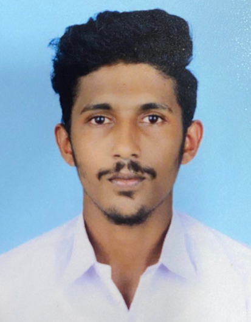

# MechoSense FYP Portfolio

**Cancellation of Self-Sensing due to Ego-Motion of Vibration Based Mechanosensors**

A Final Year Project portfolio website documenting a bio-inspired tactile sensing system for robotic navigation.

## 🚀 About

This project develops a tactile sensing framework using:
- **Echo State Networks (ESNs)** for ego-motion cancellation
- **Bionic antenna sensors** inspired by insect antennae and whiskers
- **3D localization** in low-visibility, unstructured environments

## 📁 File Structure

```
fyp-portfolio/
├── index.html          # Main portfolio page
├── css/
│   ├── bootstrap.min.css
│   └── style.css
├── js/
│   └── bootstrap.bundle.min.js
├── img/                # Add your team/project images here
│   ├── team-member-1.jpg
│   ├── team-member-2.jpg
│   ├── team-member-3.jpg
│   ├── team-member-4.jpg
│   └── project-banner.jpg
└── README.md
```

## 🖼️ Adding Images

Replace placeholder avatars in `index.html` by updating the team card sections:

```html
<!-- Find the team-avatar div and replace the letter with: -->
<div class="team-avatar">
    
</div>
```

## 📅 Updating Weekly Progress

To update progress for each week, edit `index.html` and find the matching panel (e.g., `id="w12"` for Week 1-2).

Update the `.update-box` section:
```html
<div class="update-box">
    <div class="update-label">📌 Week 2 Update — 15 Feb 2025</div>
    <p>Completed literature review. Key papers identified on ESN reservoir computing and bionic whisker designs. Bibliography compiled with 32 references.</p>
</div>
```

Update the progress bar width:
```html
<div class="progress-fill" style="width:100%"></div>
```

## 🌐 Deploying to GitHub Pages

1. Push all files to a GitHub repository
2. Go to **Settings → Pages**
3. Source: **Deploy from a branch**
4. Branch: `main` / `root`
5. Your site will be live at `https://your-username.github.io/repo-name`

## 👥 Team

Update team member names, roles, and photos in the `#team` section of `index.html`.

---
BEng Electrical & Electronic Engineering | 2024/2025
